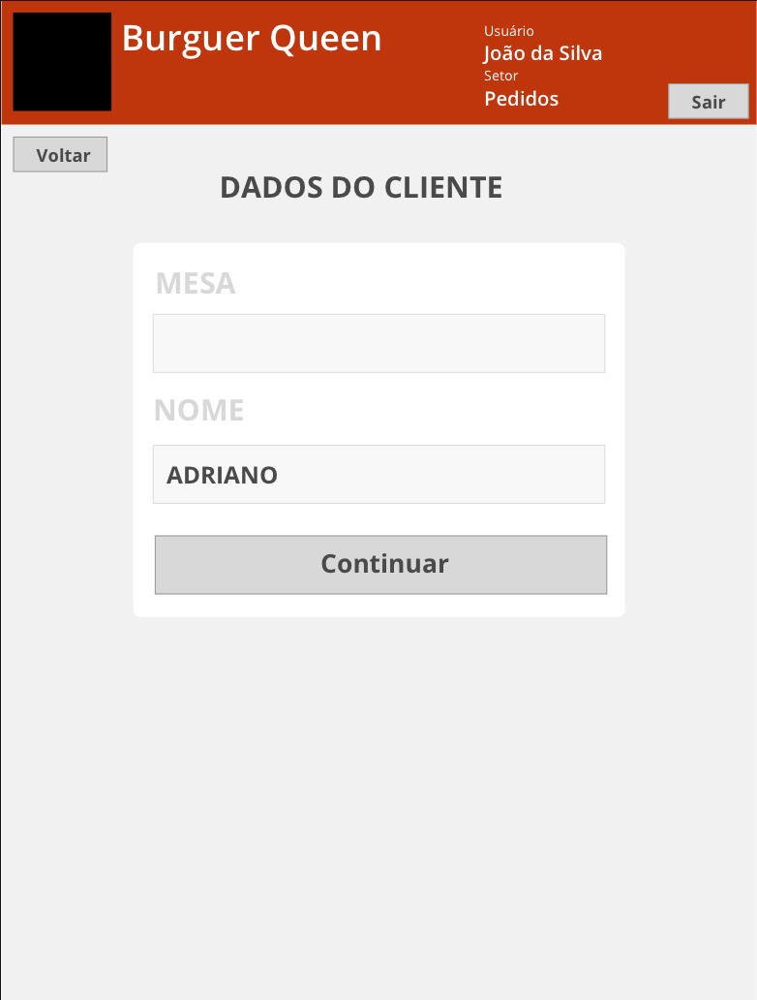
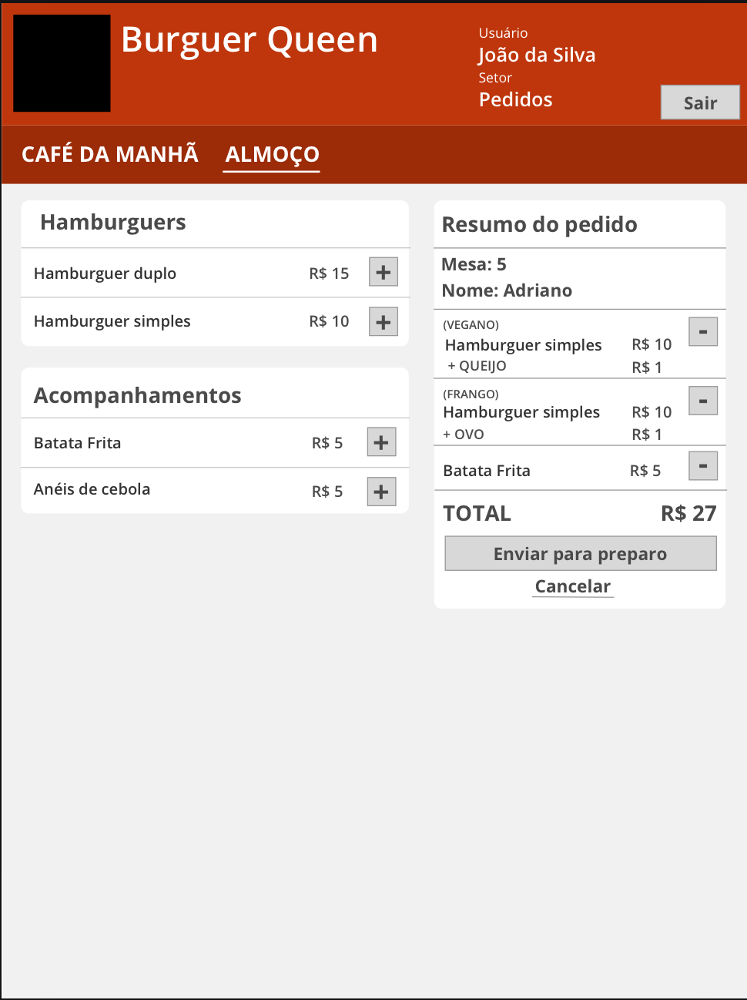
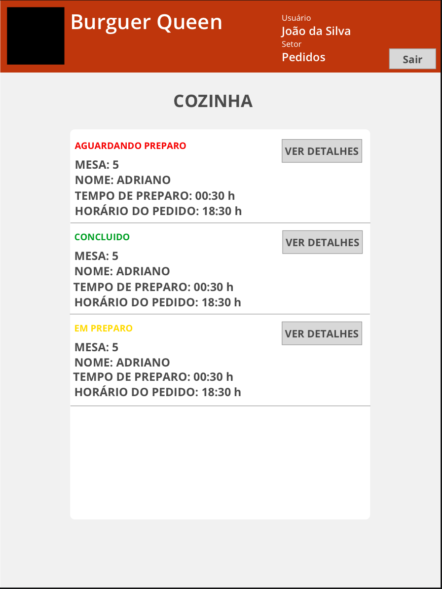

# Burger Queen

## 1. Aplicação

Um pequeno restaurante de hambúrgueres, que está crescendo, necessita uma interface em que se possa realizar pedidos utilizando um tablet, e enviá-los para a cozinha para que sejam preparados de forma ordenada e eficiente.

A interface deve mostrar os dois menus (café da manhã e restante do dia), cada um com todos os seus produtos. O usuário deve poder escolher que produtos adicionar e a interface deve mostrar o resumo do pedido com o custo total.

## 2. Protótipo do projeto

Para o layout da aparência do peojeto foi deseb=nhadi um ptotótipo no editor [Sketch](https://www.sketch.com/).

## 3. Objetivos de aprendizagem e Considerações Gerais

O objetivo principal envolveu o aprendizado da construção de uma interface web usando React. A interface também foi planejada especificamente para rodar em tablets. O aplicativo é um Single Page App.

O aplicativo utilizou scripts npm-scripts e teve start, build e deploy, que são responsáveis por iniciar, empacotar e implantar o aplicativo, respectivamente.

## 4. Critérios de aceitação mínimos cumpridos pelo projeto

**[História de usuário 1] Garçom/Garçonete deve poder anotar o seu pedido**

Eu como cliente quero poder anotar o meu pedido saber o valor de cada produto e poder enviar o pedido para a cozinha para ser preparado.

  Critérios de aceitação que foram atendidos.
- Anotar o nome e mesa.
- Adicionar produtos aos pedidos.
- Excluir produtos.
- Ver resumo e o total da compra.
- Enviar o pedido para a cozinha (guardar o pedido no banco de dados do Firebase).
- Funcionar bem e se adequar a um tablet.
  
Definição de pronto

- Foram feitos testes de usabilidade e incorporado o feedback do usuário.
- Foi feito o deploy do aplicativo utilizando o Firebase.

***

O aplicativo pode ser visualizado junto ao link: https://burger-queen-1fad9.firebaseapp.com
